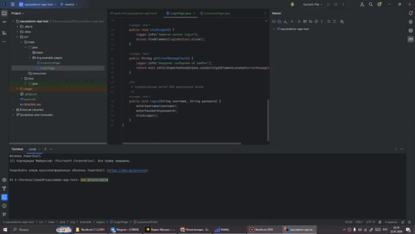

# saucedemo-aqa-test

[](https://www.oracle.com/java/)
[](https://maven.apache.org/)
[](https://www.selenium.dev/)
[](https://junit.org/junit5/)
[](https://docs.qameta.io/allure/)

автотесты логина для https://www.saucedemo.com/. стек: java, selenium, junit 5, allure. паттерн: page object model.

## демо

место для гифки:



## быстрый старт

```
mvn test
```

## отчет allure

```
mvn allure:serve
```

результаты лежат в target/allure-results.

## сценарии авторизации

- успешный логин: standard_user / secret_sauce
- неверный пароль
- заблокированный пользователь: locked_out_user
- пустые поля
- performance_glitch_user с задержкой

## структура проекта

```
src
├─ main
│  └─ java
│     └─ org/example/pages
│        ├─ LoginPage.java
│        └─ InventoryPage.java
└─ test
   └─ java
      └─ base
         ├─ BaseTest.java
         └─ LoginTest.java
```

## требования

- java 17
- maven 3.x
- chrome

## заметки

- каждый тест независим
- запуск в chrome через selenium manager
